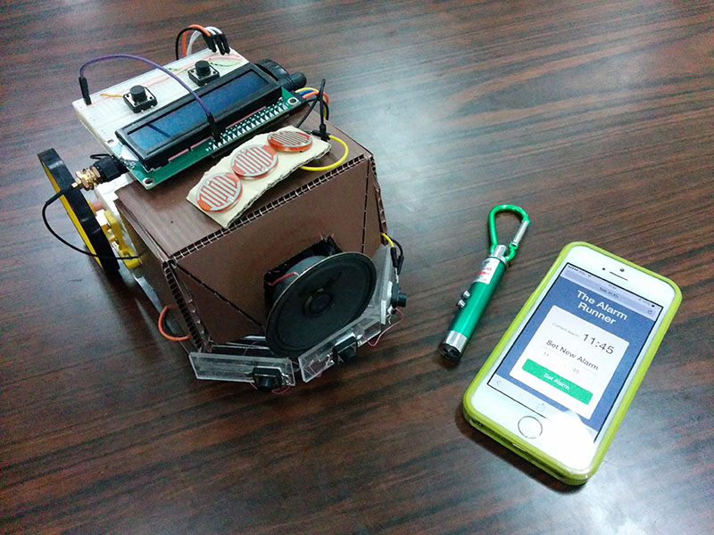

# The Alarm Runner
An arduino alarm clock that will run randomly when alarmed until it is hit by a laser beam.
Final Project for class 2110363 HW SYN LAB I of 2015 Computer Engineering, Chulalongkorn University

This source code is designed to run on ATMega168

## Features
- View current time
- View upcoming alarm
- Set alarm time on the alarm runner and sync to the server
- Runs randomly on alarm mode until it was hit by a laser beam
- Set snd view alarm time on the web page.
- Fetch Alarm time From the server

## Major Modules
- ATMega168 Arduino Board
- ESP8266 Wi-Fi Module
- 16x2 LCD with I2C Interface
- DS1307 Real-Time Clock with I2C Interface
- L298N H-Bridge Motor Driver

## The Team
- 5631045321 Thanawit Prasongpongchai
- 5631074521 Phoomin Leejongpermpoon
- 5631088321 Sirawit Yeesong
- 5630469621 Phatrasek Jirabovonvisut